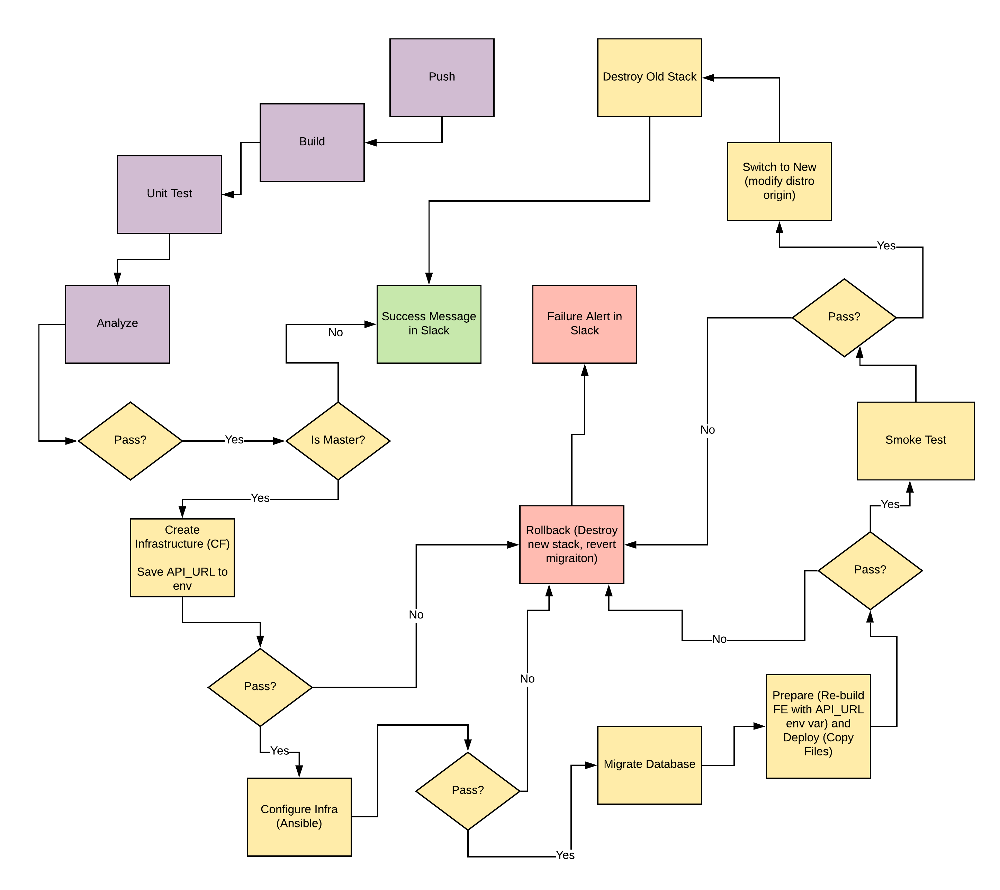
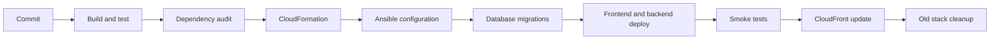

# UdaPeople CI/CD Graduation Project

[](https://circleci.com/)
[](https://aws.amazon.com/)
[](https://www.ansible.com/)
[](https://ahmed-el-mahdy.github.io/)

An end-to-end DevOps Nanodegree graduation project that builds, tests, scans, provisions, configures, deploys, verifies, promotes, and cleans up a TypeScript application on AWS.



## What This Repository Demonstrates

- A multi-job CircleCI workflow with explicit dependencies and workspace handoff.
- Frontend and backend build, unit-test, and dependency-audit stages.
- Ephemeral AWS infrastructure through CloudFormation.
- EC2 configuration and backend deployment through Ansible roles.
- Database migration execution with failure-time rollback hooks.
- Frontend publication to S3 and CloudFront distribution updates.
- Backend and frontend smoke tests before promotion.
- Cleanup of previous workflow stacks after successful release.
- Prometheus Node Exporter configuration for host-level operational visibility.

## Delivery Flow



## Repository Map

| Path | Responsibility |
| --- | --- |
| `.circleci/config.yml` | Pipeline orchestration, rollback, smoke tests, promotion, and cleanup |
| `.circleci/files` | CloudFormation templates for backend, frontend, and CloudFront |
| `.circleci/ansible` | Host configuration, deployment, and Node Exporter roles |
| `frontend` | React/TypeScript web application and tests |
| `backend` | NestJS/TypeScript API, migrations, domain logic, and tests |
| `screenshots` | Evidence captured during the original project delivery |
| `util/docker-compose.yml` | Supporting local service configuration |

## Pipeline Jobs

The workflow includes:

1. `build-frontend` and `build-backend`
2. `test-frontend` and `test-backend`
3. `scan-frontend` and `scan-backend`
4. `deploy-infrastructure`
5. `configure-infrastructure`
6. `run-migrations`
7. `deploy-frontend` and `deploy-backend`
8. `smoke-test`
9. `cloudfront-update`
10. `cleanup`

Failure handlers can revert the latest migration and delete workflow-specific CloudFormation stacks. Review those commands carefully before running the pipeline against an AWS account.

## Review Locally

The safest first step is static inspection:

```bash
git clone https://github.com/ahmed-el-mahdy/udapeople-cicd.git
cd udapeople-cicd

circleci config validate .circleci/config.yml
aws cloudformation validate-template --template-body file://.circleci/files/backend.yml
aws cloudformation validate-template --template-body file://.circleci/files/frontend.yml
```

The CloudFormation validation commands contact AWS but do not create stacks. Application tests use the dependency versions locked in each package directory.

## Required CI Context

The pipeline expects AWS credentials, database values, an SSH key, and KVDB configuration in CircleCI project settings or contexts. Keep all values outside the repository and scope credentials to the smallest required set of actions.

## Security and Modernization Notes

- This is a historical training project and uses Node.js 13-era dependencies. Upgrade and retest before reuse.
- Replace dependency mutation during CI (`npm audit fix`) with deterministic install, reporting, and controlled remediation.
- Pin external downloads and validate checksums.
- Replace long-lived AWS keys with short-lived federation where the CI platform supports it.
- Restrict EC2 security groups, protect SSH keys, and review every rollback/delete command against the target account.
- Modern deployments should add artifact provenance, image or package SBOMs, and policy checks.

## Status

This repository is preserved as evidence of a complete CI/CD lifecycle, including rollback and operational verification. It is not presented as a current production baseline without dependency and security modernization.
